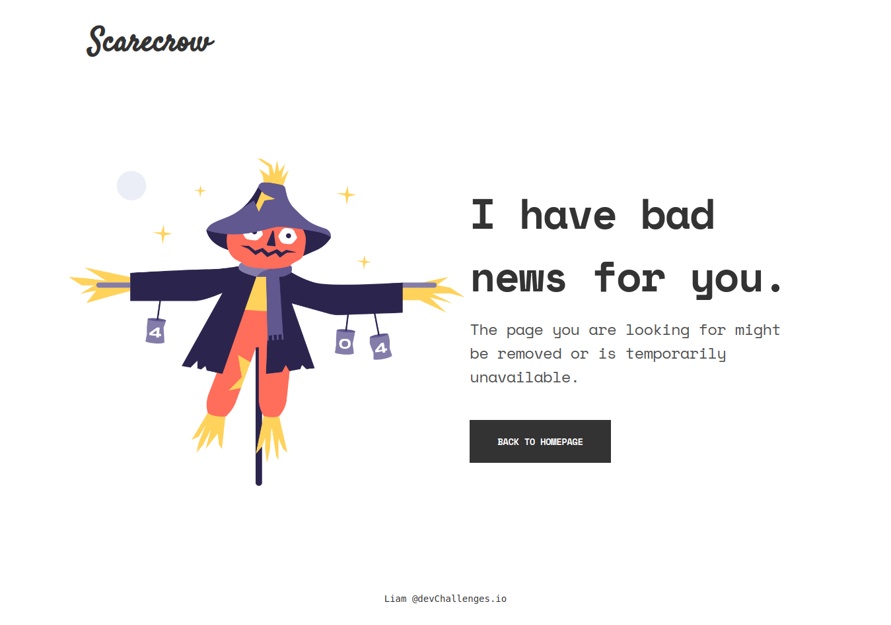

<h1 align="center">Scarecrow 🎃</h1>

## Overview
This is a solution for a challenge from [DevChallenges.io](https://devchallenges.io/). Just a basic but cool and responsive 404 page.

[Checkout the demo](https://claymeers.github.io/Scarecrow/)

### Built With
- [HTML](https://developer.mozilla.org/en-US/docs/Web/HTML)
- [CSS](https://developer.mozilla.org/en-US/docs/Web/CSS)
- [JavaScript](https://developer.mozilla.org/en-US/docs/Web/JavaScript)

## Resources
- [Google fonts](https://fonts.google.com/) - for fonts
- [DevChallenges](https://devchallenges.io/) - for the design
- [Flaticon](https://www.flaticon.com/) - for the favicon

## Acknowledgements

- Organise the structure
- Display, center and position
- **Resposive** - Make the page mobile friendly

## Author
Scacrow is developed by [@Naveen](https://github.com/claymeers)</h1>